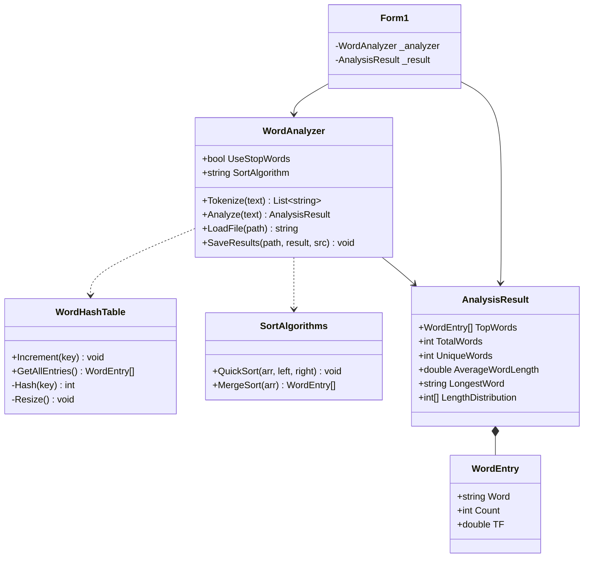

# Анализатор частотности слов в тексте

Министерство науки и высшего образования Российской Федерации  
Федеральное государственное бюджетное образовательное учреждение высшего образования  
«Тверской государственный технический университет» (ТвГТУ)  

**Курсовая работа**  
по дисциплине «Алгоритмизация и программирование»  
Тема: «Анализатор частотности слов в тексте»  

Выполнил: студент 1 курса группы Б.ПИН.ИИ.25.16, Пестов Михаил Александрович  
Проверил: Лисничук Арина Бахытжановна  
г. Тверь, 2026

---

## 1. Аннотация программного продукта

Данный репозиторий содержит исходный код десктопного приложения для автоматического частотного анализа текстовых документов. Программный продукт разработан на платформе **.NET 8** с использованием языка программирования **C#** и технологии построения графического интерфейса **Windows Forms**.

Целью проекта является практическая реализация ключевых структур данных и алгоритмов обработки текста: собственной **хеш-таблицы** с открытой адресацией, алгоритмов **токенизации**, **сортировки** (QuickSort и MergeSort) и вычисления метрики **TF (Term Frequency)**. Все алгоритмы и структуры данных реализованы вручную без использования библиотечных аналогов.

---

## 2. Математическая модель

### Хеш-таблица

Для подсчёта частот слов используется собственная хеш-таблица с **открытой адресацией и линейным пробированием**.

| Характеристика | Значение |
|---|---|
| Начальный размер | 131 071 (простое число) |
| Коэффициент заполнения | α < 0,7 |
| Расширение | NextPrime(capacity × 2) |
| Хеш-функция | Полиномиальный хеш djb2 |

Хеш-функция: `hash = 5381; hash = hash * 33 ^ c` для каждого символа строки.

Сложность операций:

| Операция | Средний случай | Худший случай |
|---|---|---|
| Вставка / обновление | O(1) | O(n) |
| Поиск | O(1) | O(n) |
| Расширение | O(n) | O(n) |

### Метрика TF (Term Frequency)

$$TF(t) = \frac{count(t)}{N}$$

где `count(t)` — количество вхождений слова `t`, `N` — общее число слов в документе (после фильтрации стоп-слов).

**Свойства:** значение ∈ [0; 1], сумма TF по всем уникальным словам = 1,0.

### Алгоритмы сортировки

| Алгоритм | Лучший | Средний | Худший | Память | Устойчивость |
|---|---|---|---|---|---|
| QuickSort | O(n log n) | O(n log n) | O(n²) | O(log n) | Нет |
| MergeSort | O(n log n) | O(n log n) | O(n log n) | O(n) | Да |

---

## 3. Реализованные алгоритмы

### Хеш-таблица `WordHashTable`
Хранит пары «слово → счётчик». Метод `Increment(key)` увеличивает счётчик слова на 1 или добавляет новое слово. При достижении коэффициента заполнения 0,7 выполняется автоматическое расширение с перехешированием всех элементов.

### Токенизация `WordAnalyzer.Tokenize`
Посимвольный обход текста с накоплением букв в буфере. Приводит все символы к нижнему регистру, корректно обрабатывает дефисные слова («хеш-таблица»), отбрасывает цифры и знаки препинания. Сложность: **O(L)**, где L — длина текста.

### Анализ `WordAnalyzer.Analyze`
Объединяет все этапы: токенизация → заполнение хеш-таблицы → фильтрация стоп-слов → сортировка → формирование топ-50 → вычисление TF → распределение длин слов.

### Быстрая сортировка `SortAlgorithms.QuickSort`
Сортировка массива `WordEntry[]` по убыванию `Count` на месте (in-place). Опорный элемент — последний в подмассиве. Метод `Partition` перераспределяет элементы относительно опорного.

### Сортировка слиянием `SortAlgorithms.MergeSort`
Возвращает новый отсортированный массив, не изменяя исходный. Гарантированное время O(n log n) в любом случае.

### Сохранение результатов `WordAnalyzer.SaveResults`
Записывает отчёт в текстовый файл в кодировке UTF-8: статистика, топ-50 слов с частотой и TF, распределение длин слов.

---

### Ключевые классы



---

## 4. Графический интерфейс

Приложение содержит панель управления и четыре вкладки:

| Вкладка | Содержимое |
|---|---|
| **Топ-50 слов** | Таблица с колонками: №, Слово, Частота, TF (доля), Визуализация (полоска █). Топ-3 выделены жёлтым, 4–10 — зелёным. |
| **Облако слов** | Графическое облако топ-50 слов. Размер шрифта (10–48 пт) пропорционален частоте. Алгоритм предотвращает наложение слов. |
| **Гистограмма длин** | Столбчатая диаграмма распределения длин слов. Ось X — длина в символах, ось Y — количество слов. |
| **Статистика** | Форматированный отчёт: файл, алгоритм, время анализа, всего/уникальных слов, средняя длина, самое длинное слово, топ-10 с TF. |

**Панель управления:**
- `[Открыть файл]` — загрузка .txt файла до 10 МБ
- `[Анализировать]` — запуск анализа
- `[Сохранить отчёт]` — экспорт результатов в .txt
- `[✓] Фильтровать стоп-слова` — включение/отключение фильтрации
- `Сортировка: [QuickSort ▼]` — выбор алгоритма (QuickSort / MergeSort)

---

## 5. Модульное тестирование

Верификация алгоритмов проведена с использованием фреймворка **NUnit 3**. Тесты спроектированы по паттерну **AAA (Arrange — Act — Assert)** и сгруппированы по тестируемым компонентам.

### Покрытые сценарии (42 теста)

| Группа | Кол-во тестов | Что проверяется |
|---|---|---|
| `WordHashTableTests` | 8 | Вставка, накопление счётчика, коллизии, производительность 50 000 слов |
| `TokenizerTests` | 9 | Пунктуация, регистр, дефисы, цифры, пустая строка, 100 000 слов |
| `TFAnalysisTests` | 12 | Точность TF, сумма TF = 1, стоп-слова, статистика, топ-50, 50 000 слов |
| `SortAlgorithmsTests` | 13 | QuickSort и MergeSort: типичные данные, граничные случаи, согласованность |

---

## 6. Инструкция по сборке и запуску

Для компиляции и запуска необходима платформа **.NET 8 SDK** и операционная система **Windows** (требование Windows Forms).

### Через Visual Studio

1. Клонировать репозиторий в локальную файловую систему.
2. Открыть файл решения `Kursovaya25.sln` в Visual Studio 2022.
3. Установить проект `Kursovaya25` в качестве загружаемого по умолчанию.
4. Выполнить сборку решения (`F6`).
5. Запустить приложение (`F5`).

### Через терминал

```bash
git clone <url>
cd Kursovaya25
dotnet run --project Kursovaya25/Kursovaya25.csproj
```

### Запуск тестов

```bash
dotnet test Kursovaya25.Tests/Kursovaya25.Tests.csproj
```

### Системные требования

- .NET 8 SDK или выше
- Windows 10/11 (для работы Windows Forms)
- Visual Studio 2022 (рекомендуется) или любой редактор с поддержкой .NET

---
